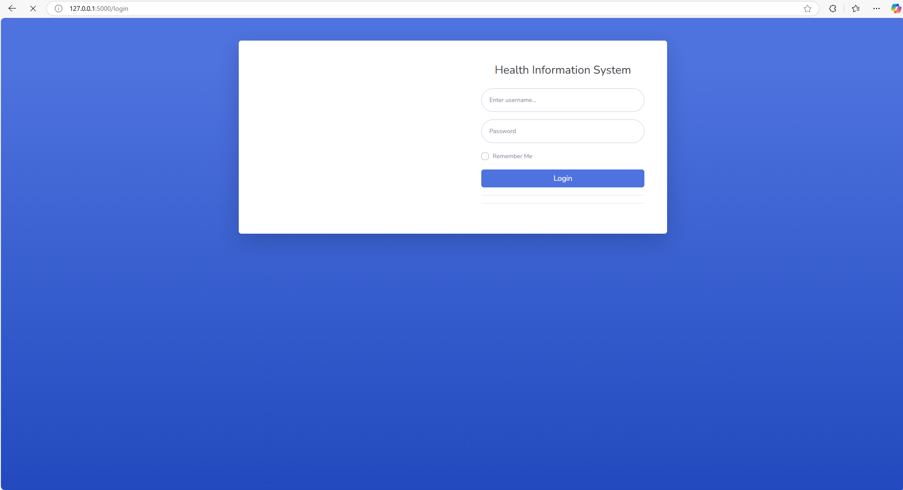
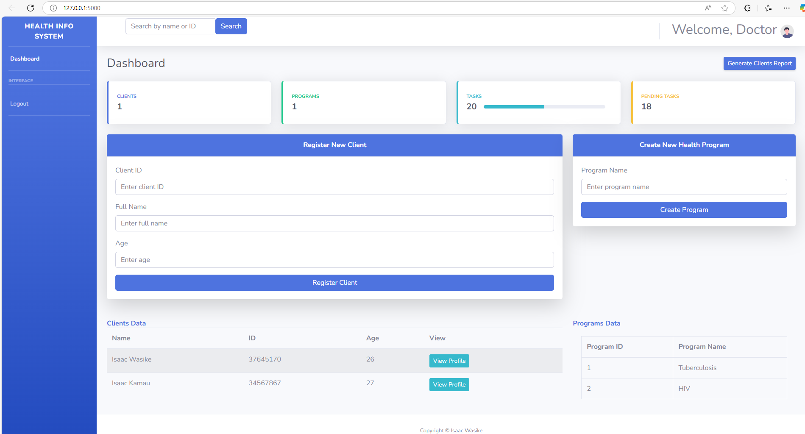
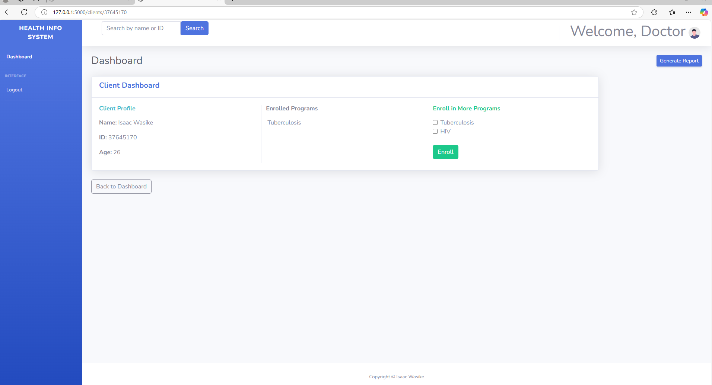
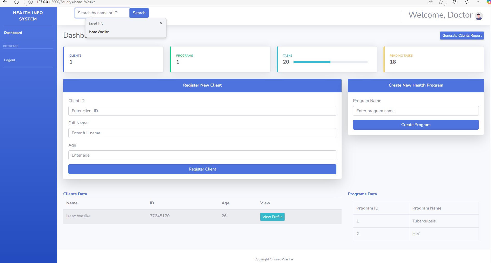
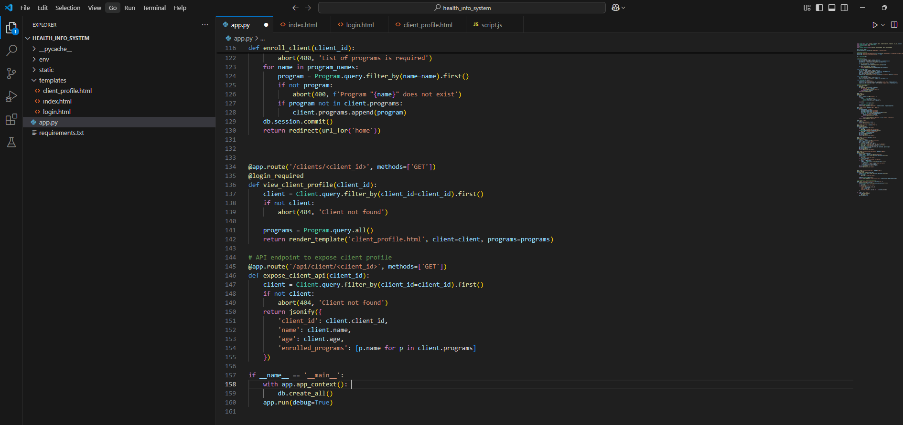
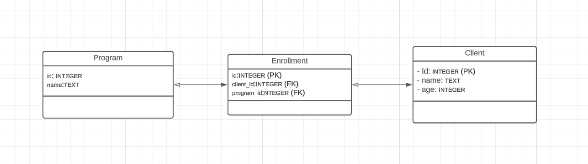
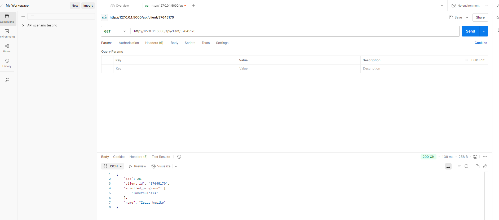

Deployed on Render,Link:https://health-information-system-jvd6.onrender.com/login
Login Credentials:
username:Doctor
Password:password123
 # Health Information System

    This project is a basic health information system designed for a doctor to manage clients and health programs/services.
    It was developed as part of a Software Engineering Practical Task.

    The system allows the doctor to:

        Create new health programs (e.g., Tuberculosis, Malaria, HIV).

        Register and manage clients.

        Enroll clients into one or multiple programs.

        Search for registered clients.

        View client profiles with enrolled programs.

        Expose client profiles via a REST API for external access.

# Technologies Used
    Backend: Python (Flask)

    Frontend: HTML, CSS, Bootstrap 4 

    Database: PostgreSQL

    Tools: VS Code, Postman (for API testing)

# Setup Instructions
Clone the repository:

    git clone https://github.com/your-username/health-info-system.git

    cd health-info-system

Create a virtual environment:

    python -m venv venv
    venv\Scripts\activate

Install dependencies:

    pip install -r requirements.txt

Run the application:

    flask run
# Access the app:

    Open http://127.0.0.1:5000 

#  API Endpoints

    GET /api/client/37645170 

    Example response:

        json
        {
        "id": 1,
        "name": "Isaac Wasike",
        "age": 26,
        "programs": ["Tuberculosis"]
        }
## Screenshots

### 1. Login Page

---

### 2. Dashboard

---

### 3. Programs Table

---
### 4. After Search

---
### 5. File Structure

---
### 6. Database Design

---

### 7. Postman API Test

# License
    This project is open for review and educational purposes.

# Author
    Isaac Wasike
    Software Engineerings Candidate
